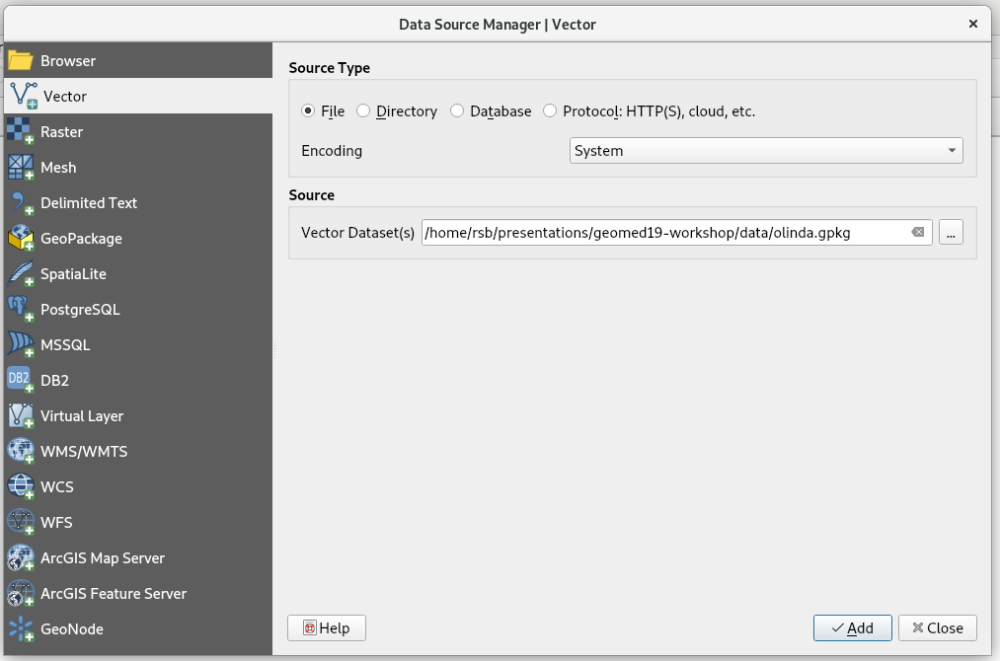
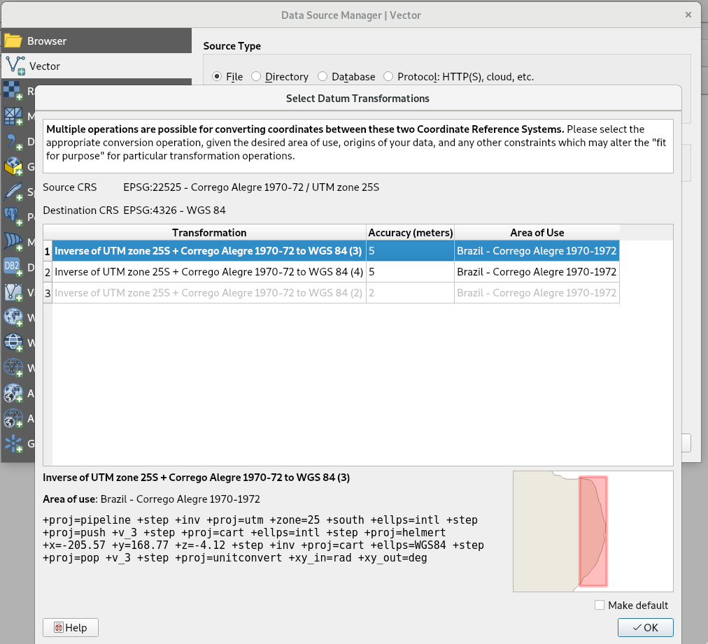
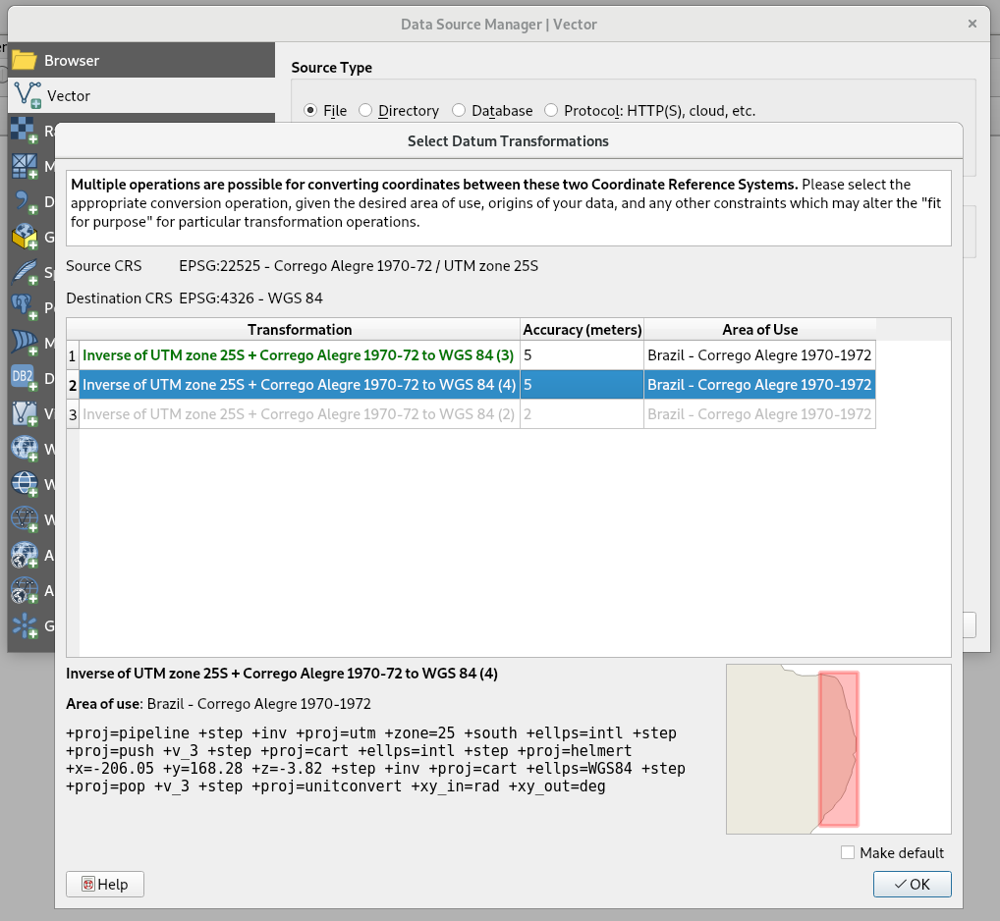
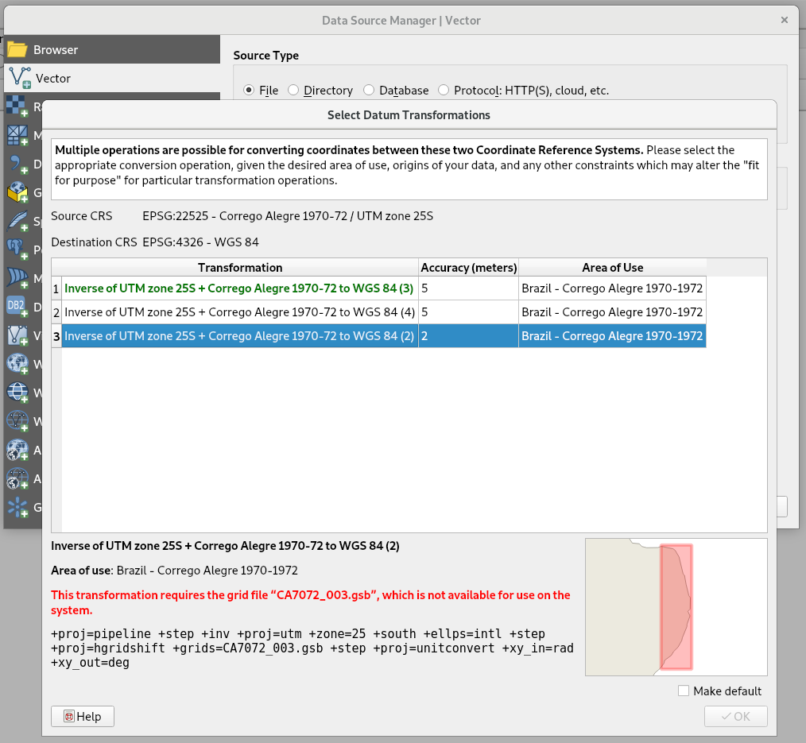
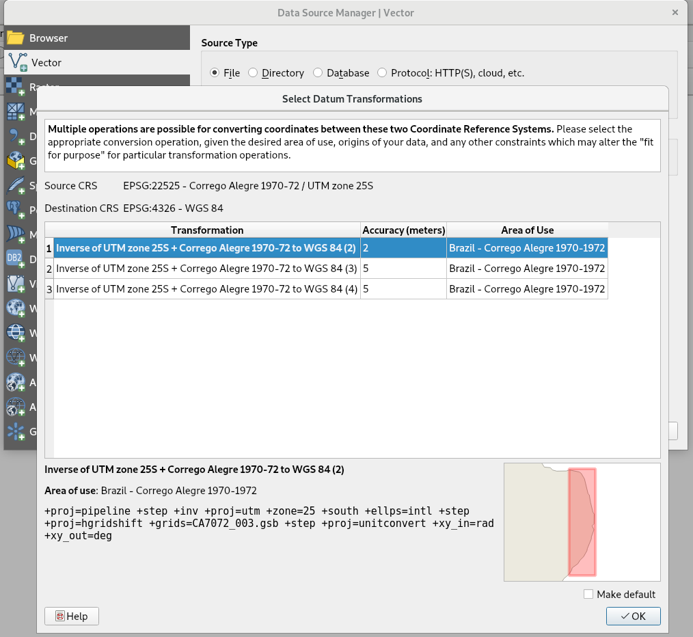
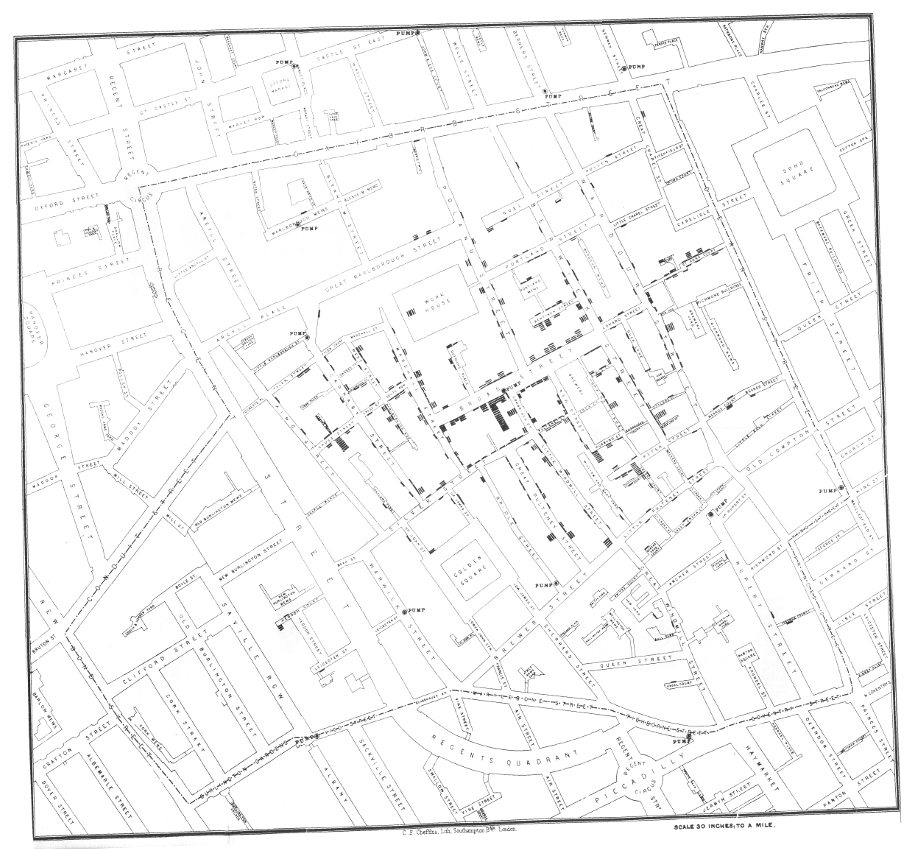
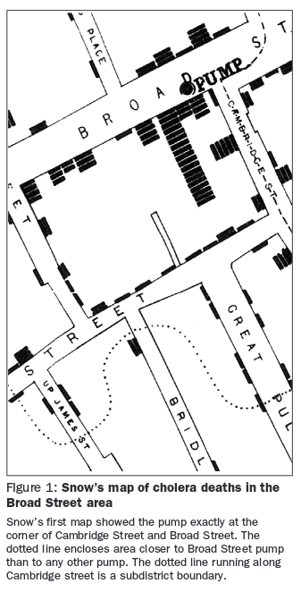

```{r setup, include=FALSE}
knitr::opts_chunk$set(echo = FALSE)
```

### Copyright

All the material presented here, to the extent it is original, is available under [CC-BY-SA](https://creativecommons.org/licenses/by-sa/4.0/).

### Required current contributed CRAN packages:

I am running R 3.6.1, with recent `update.packages()`.

```{r, echo=TRUE}
#needed <- c("sf", "mapview", "sp", "spdep", "elevatr", "raster", "stars", "classInt", 
#  "RColorBrewer", "tmap", "tmaptools", "cartography", "ggplot2", "colorspace")
```

### Script

Script at . Download to suitable location and use as basis.


## Session II

- 11:10-11:40 (20+10) Ongoing changes in external sofware (GEOS, GDAL), including software and standards used for representing spatial reference systems (PROJ)

- 11:40-12:10 (20+10) GIS bridges (description and using GRASS and **rgrass7**)

- 12:10-12:50 (20+20) Using R as a GIS (topological operations)

## Ongoing changes in external sofware (GEOS, GDAL, PROJ)


```{r echo=FALSE}
knitr::include_graphics('sf_deps.png')
```


### PROJ

Because so much open source (and other) software uses the PROJ library and framework, many are affected when PROJ upgrades. Until very recently, PROJ has been seen as very reliable, and the changes taking place now are intended to confirm and reinforce this reliability. Before PROJ 5 (PROJ 6 is out now, PROJ 7 is coming early in 2020), the `+datum=` tag was used, perhaps with `+towgs84=` with three or seven coefficients, and possibly `+nadgrids=` where datum transformation grids were available. However, transformations from one projection to another first inversed to longitude-latitude in WGS84, then projected on to the target projection.


### Big bump coming:

'Fast-forward 35 years and PROJ.4 is everywhere: It provides coordinate handling for almost every geospatial program, open or closed source. Today,  we  see  a  drastical  increase  in  the  need  for  high  accuracy  GNSS  coordinate  handling, especially in the agricultural and construction engineering sectors.  This need for geodetic-accuracy transformations  is  not  satisfied  by  "classic  PROJ.4".  But  with  the  ubiquity  of  PROJ.4,  we  can provide these transformations "everywhere", just by implementing them as part of PROJ.4' [@evers+knudsen17].


### Escaping the WGS84 hub/pivot: PROJ and OGC WKT2


Following the introduction of geodetic modules and pipelines in PROJ 5 [@knudsen+evers17; @evers+knudsen17], PROJ 6 moves further. Changes in the legacy PROJ representation and WGS84 transformation hub have been coordinated through the [GDAL barn raising](https://gdalbarn.com/) initiative. Crucially WGS84 often ceases to be the pivot for moving between datums. A new OGC WKT is coming, and an SQLite EPSG file database has replaced CSV files. SRS will begin to support 3D by default, adding time too as SRS change. See also [PROJ migration notes](https://proj.org/development/migration.html).

There are very useful postings on the PROJ mailing list from Martin Desruisseaux, first [proposing clarifications](https://lists.osgeo.org/pipermail/proj/2019-July/008748.html) and a [follow-up](https://lists.osgeo.org/pipermail/proj/2019-August/008750.html) including a summary:

> * "Early binding" ≈ hub transformation technique.

> * "Late binding" ≈ hub transformation technique NOT used, replaced by
a more complex technique consisting in searching parameters in the
EPSG database after the transformation context (source, target,
epoch, area of interest) is known.

> * The problem of hub transformation technique is independent of WGS84.
It is caused by the fact that transformations to/from the hub are
approximate. Any other hub we could invent in replacement of WGS84
will have the same problem, unless we can invent a hub for which
transformations are exact (I think that if such hub existed, we
would have already heard about it).

> The solution proposed by ISO 19111 (in my understanding) is:

> * Forget about hub (WGS84 or other), unless the simplicity of
early-binding is considered more important than accuracy.

> * Associating a CRS to a coordinate set (geometry or raster) is no
longer sufficient. A {CRS, epoch} tuple must be associated. ISO
19111 calls this tuple "Coordinate metadata". From a programmatic
API point of view, this means that getCoordinateReferenceSystem()
method in Geometry objects (for instance) needs to be replaced by a
getCoordinateMetadata() method.


In QGIS built on current PROJ 6 with the `proj.h` API (and GDAL built on current PROJ 6 with the `proj.h` API), we see the following sequence of GUI windows when trying to open the olinda.gpkg file.


```{r echo=FALSE}

```

Instead of using the declared coordinate reference system of the added layer to provide a transformation/conversion relationship to possible WGS84 geographical coordinate or web mapping backgrounds, the user of the most recent QGIS version with PROJ 6 faces a choice of three alternatives with varying availabilities and precisions:

```{r echo=FALSE}

```

```{r echo=FALSE}

```

The third alternative has better precision, but depends on finding and installing an NTv2 grid file in the PROJ `shared/proj` metadata folder:

```{r echo=FALSE}

```

If we install the file, the choices change to promote the more precise NTv2-based path to the first position:

```{r echo=FALSE}

```

```{r, echo=TRUE}
library(sf)
packageVersion("sf")
```

The final element reported by `sf::sf_extSoftVersion()` shows whether **sf** was built with the `proj.h` interface to PROJ, or the legacy `proj.api.h` interface. However, GDAL also has to be built with the `proj.h` interface for everything to line up:

```{r, echo=TRUE}
sf_extSoftVersion()
```


```{r, echo=TRUE}
st_crs(22525)
```

The OGC WTK2 definition now contains a usage/scope term showing where the definition may be used; there may also be a temporal frame for a definition.

```{r, echo=TRUE}
cat(system("projinfo EPSG:22525", intern=TRUE), sep="\n")
```

If we ask about possible transformations/conversions, we see choices we saw among those represented in QGIS (I work on two apparently identical systems, which may give different choice counts)

```{r, echo=TRUE}
cat(system("projinfo -s EPSG:22525 -t EPSG:31985", intern=TRUE), sep="\n")
```

The input data use the Corrego Alegre 1970-1972 setting, and still provide a `+towgs84=` key representation for pivoting through WGS84:

```{r, echo=TRUE}
olinda <- st_read("data/olinda.gpkg", quiet=TRUE)
st_crs(olinda)
```

We'll just use one point to check things out:

```{r, echo=TRUE}
xy_c <- st_centroid(st_geometry(olinda[  1,]))
st_coordinates(xy_c)
```

If we manually pivot through WGS84 on the way back to SIRGAS2000 UTM, we get:

```{r, echo=TRUE}
st_coordinates(st_transform(st_transform(xy_c, 4326), 31985))
```

Without the NTv2 grid file `CA7072_003.gsb` we seem to get the same:

```{r, echo=TRUE}
# without CA7072_003.gsb
st_coordinates(st_transform(xy_c, 31985))
```

but we also get the same with the grid file if we leave the `+towgs84=` key in the PROJ string:

```{r, echo=TRUE, eval=FALSE}
# with CA7072_003.gsb
st_coordinates(st_transform(xy_c, 31985))
#          X       Y
# 1 295489.3 9120352
```

If however we manipulate the PROJ string to specify the grid file instead of the `+towgs84=` key, we can get the improved precision:

```{r, echo=TRUE, eval=FALSE}
# with CA7072_003.gsb
xy_c1 <- xy_c
st_crs(xy_c1) <- "+proj=utm +zone=25 +south +ellps=intl +units=m +nadgrids=CA7072_003.gsb"
print(st_coordinates(st_transform(xy_c1, 31985)), digits=9)
#            X          Y
# 1 295486.396 9120350.62
```

Let's try to use the PROJ utility program `cs2cs` in its PROJ 6 version. The `cs2cs` version when the grid file is present matches `sf::st_transform()` when the input CRS is modified to point to the grid file:

```{r, echo=TRUE, eval=FALSE}
# with CA7072_003.gsb
cat(system(paste0("echo ", paste(xy, collapse=" "), " | cs2cs EPSG:22525 EPSG:31985"), intern=TRUE))
# 295486.40 9120350.62 0.00
```

`cs2cs` without the grid file gives:

```{r, echo=TRUE}
xy <- st_coordinates(xy_c)
# without CA7072_003.gsb
cat(system(paste0("echo ", paste(xy, collapse=" "), " | cs2cs EPSG:22525 EPSG:31985"), intern=TRUE))
```

This matches the second set of `+towgs84=` coefficients:

```{r, echo=TRUE, warning=FALSE}
# without CA7072_003.gsb
xy_c2 <- xy_c
st_crs(xy_c2) <- "+proj=utm +zone=25 +south +ellps=intl +units=m +towgs84=-206.05,168.28,-3.82,0,0,0,0"
st_coordinates(st_transform(xy_c2, 31985))
```

Using the `lwgeom::st_transform_proj()` for now uses the `proh_api.h` interface:

```{r, echo=TRUE}
# without CA7072_003.gsb
# -DACCEPT_USE_OF_DEPRECATED_PROJ_API_H
st_coordinates(lwgeom::st_transform_proj(xy_c, 31985))
```

Our reprojected objects in SIRGAS2000 used the WGS84 pivot with one of two possible sets of `+towgs84=` coefficients:

```{r, echo=TRUE}
olinda <- st_read("output/olinda_sirgas2000.gpkg", quiet=TRUE)
xy_c <- st_centroid(st_geometry(olinda[  1,]))
st_coordinates(xy_c)
```


This is the EPSG decription of the grid file: https://epsg.io/5541

It was retrieved from: https://www.eye4software.com/files/ntv2/ca70.zip

This [page](https://ww2.ibge.gov.br/home/geociencias/geodesia/default_sirgas_int.shtm?c=11) gives a picture of why the changes in PROJ matter - the arrows are in cm per year displacement.

Some grid files are available from https://proj.org/download.html, but because many others are not as freely available (yet), they may need to be dwnloaded from national mapping agencies. Most are relatively large, and also need to be versioned. Do read the README files in the zip archives!

### GEOS

A recent upgrade of GEOS from 3.7.1 to 3.7.2 on a CRAN test server led to failures in three packages using **rgeos** for topological operations. **rgeos** 0.4-3 set the `checkValidity=`  argument to for example `gIntersection()` to FALSE (TRUE threw an error if either geometry was invalid). An [issue](https://github.com/r-spatial/sf/issues/1121) was opened on the **sf** github repository (**rgeos** is developed on R-Forge). The test objects (from an example from **inlmisc**) will be used here:

```{r, echo=TRUE}
rgeos::version_GEOS0()
```

For **rgeos** <= 0.4-3, the default was not to check input geometries for validity before trying topological operations, for >= 0.5-1, the default changes when GEOS > 3.7.1 to check for validity. The mode of the argument also changes to integer from logical:

```{r, echo=TRUE, warning=FALSE}
cV_old_default <- ifelse(rgeos::version_GEOS0() >= "3.7.2", 0L, FALSE)
yy <- rgeos::readWKT(readLines("data/invalid.wkt"))
rgeos::gIsValid(yy, byid=TRUE, reason=TRUE)
```

```{r, echo=TRUE}
sf::sf_extSoftVersion()
```

The same underlyng GEOS code is used in **sf**:

```{r, echo=TRUE}
sf::st_is_valid(sf::st_as_sf(yy), reason=TRUE)
```
The geometries were also invalid in GEOS 3.7.1, but the operations succeeded:

```{r, echo=TRUE, warning=FALSE}
ply <- rgeos::readWKT(readLines("data/ply.wkt"))
oo <- try(rgeos::gIntersection(yy, ply, byid=TRUE, checkValidity=cV_old_default), silent=TRUE)
print(attr(oo, "condition")$message)
```
```{r, echo=TRUE}
ooo <- try(sf::st_intersection(sf::st_as_sf(yy), sf::st_as_sf(ply)), silent=TRUE)
print(attr(oo, "condition")$message)
```
In **rgeos** 0.5-1 and GEOS 3.7.2, new warnings are provided, and advice to check validity.

```{r, echo=TRUE}
cV_new_default <- ifelse(rgeos::version_GEOS0() >= "3.7.2", 1L, TRUE)
try(rgeos::gIntersection(yy, ply, byid=TRUE, checkValidity=cV_new_default), silent=TRUE)
```

New options are provided, `get_RGEOS_CheckValidity()` and `set_RGEOS_CheckValidity()`, because in some packages the use of topological operations may happen through other packages, such as `raster::crop()` calling `rgeos::gIntersection()` without access to the arguments of the latter function.

If we follow the advice, zero-width buffering is used to try to rectify the invalidity:

```{r, echo=TRUE}
oo <- rgeos::gIntersection(yy, ply, byid=TRUE, checkValidity=2L)
rgeos::gIsValid(oo)
```

equivalently:

```{r, echo=TRUE}
oo <- rgeos::gIntersection(rgeos::gBuffer(yy, byid=TRUE, width=0), ply, byid=TRUE, checkValidity=1L)
rgeos::gIsValid(oo)
```

and by extension to **sf** until GEOS 3.7.2 is accommodated:

```{r, echo=TRUE}
ooo <- sf::st_intersection(sf::st_buffer(sf::st_as_sf(yy), dist=0), sf::st_as_sf(ply))
all(sf::st_is_valid(ooo))
```

The actual cause was the use of an ESRI/shapefile style/understanding of the self-touching exterior ring. In OGC style, an interior ring is required, but not in shapefile style. Martin Davis responded in the issue:

> The problem turned out to be a noding robustness issue, which caused the valid input linework to have a self-touch after noding. This caused the output to be invalid. The fix was to tighten up the internal overlay noding validation check to catch this situation. This has the side-effect of detecting (and failing) all self-touches in input geometry. Previously, vertex-vertex self-touches were not detected, and in many cases they would simply propagate through the overlay algorithm. (This made the output invalid as well, but since the inputs were already invalid this behaviour was considered acceptable).

The change in GEOS behaviour was not planned as such, but has consequences, fortunately detected because CRAN checks by default much more than say Travis by default. Zero-width buffering will not repair all cases of invalidity, but does work here.

## GIS bridges (description and using GRASS and **rgrass7**)

### GIS interfaces

Because GIS can be used as databases, and their tools can be better suited to some analyses and operations, it may be sensible to use one in addition to data analysis software. There is an extra effort required when using linked software systems, because they may not integrate easily. Since R is open source, and R spatial packages use open source components, staying with open source GIS means that many of the underlying software components are shared. This certainly applies to R and GRASS, and through GRASS, also to R and QGIS --- QGIS is more file-based than GRASS, which has an underlying data storage specification.

GIS interfaces can be as simple as just reading and writing files using loose coupling, once the file formats have been worked out, that is. The GRASS 7 interface **rgrass7** on CRAN is the current, stable interface. In addition to the GRASS interface, which is actively maintained, there are several others: **link2GI** packages interfaces to several GI systems; **RQGIS** is for QGIS but links through to GRASS and SAGA [@muenchowetal17] using **reticulate**; **RSAGA** links to, scripting and running SAGA from R; **rpostgis** is for PostGIS [@bucklin+basille18]. The **arcgisbinding** package is published and distributed by [ESRI using Github](https://github.com/R-ArcGIS/r-bridge), and provides some file exchange facilities for vector and attribute data (newer versions may have raster too). 

### Layering of shells


The interface between R and GRASS uses the fact that GRASS modules can be run as command line programs at the shell prompt. The shell has certain environment variables for GRASS set, for example saying where the data is stored, but is otherwise a regular shell, from which R can be started. This instance of R inherits the environment variables set by GRASS

```{r echo=FALSE}
knitr::include_graphics('gc009_04a.pdf')
```


Finally, although for research purposes it may be prefered to have data analysis software, such as R, facing the user, it is possible to try to embed this component in the workflow, so that the end user does not need so much training --- but then an ``expert'' has to codify the steps needed in advance.


```{r echo=FALSE}
knitr::include_graphics('links0.pdf')
```

### Two sides of the R/GRASS interface

The R/GRASS interface came into being in 1998/1999, and is covered in Bivand [@bivand:00] and [a conference paper by Bivand and Neteler](http://www.geocomputation.org/2000/GC009/Gc009.htm); and [@bivand:14]. R was started in a GRASS LOCATION, and spatial data was exchanged between GRASS and R, running as it were in tandem; the workflows were not integrated. **spgrass6** and its use discussed in Neteler and Mitasova [-@neteler+mitasova:08] continued this approach, but about that time steps were taken to permit scripting GRASS from R in existing LOCATIONs, like **RSAGA**. Shortly afterwards, **spgrass6** and now **rgrass7** introduced the possibility of creating a temporary GRASS LOCATION permitting GIS operations on data from the R side.

### GRASS sessions

The package may be used in two ways, either in an R session started from within a GRASS session from the command line, or with the `initGRASS()` function. The function may be used with an existing GRASS location and mapset, or with a one-time throw-away location, and takes the GRASS installation directory as its first argument. It then starts a GRASS session within the R session, and is convenient for scripting GRASS in R, rather than Python, which is be the GRASS scripting language in GRASS 7. Other arguments to `initGRASS()` may be used to set up the default region using standard tools like `Sys.setenv`; resolution and projection may be set or reset subsequently.

### Running GRASS from R

Each GRASS command takes an `--interface-description` flag, which when run returns an XML description of its flags and parameters. These descriptions are used by the GRASS GUI to populate its menus, and are also used in **rgrass7** to check that GRASS commands are used correctly. This also means that the `parseGRASS` function can set up an object in a searchable list on the R side of the interface, to avoid re-parsing interface descriptions that have already been encountered in a session. 

The middle function is `doGRASS`, which takes the flags and parameters chosen, checks their validity --- especially type  (real, integer, string), and constructs a command string. Note that multiple parameter values should be a vector of values of the correct type. Finally, `execGRASS` uses the `system` or `system2` function to execute the GRASS command with the chosen flag and parameter values; the `intern=` argument asks that what GRASS returns be placed in an R object.

In general use, `execGRASS` calls `doGRASS`, which in turn calls `parseGRASS`. Use of `execGRASS` has been simplified to permit parameters to be passed through the R ellipsis ($\ldots$) argument structure. Consequently, the scripter can readily compare [the help page of any GRASS command](https://grass.osgeo.org/grass76/manuals/index.html) with the version of the value returned by `parseGRASS` showing the parameters and flags expected. GRASS add-ons are also accommodated in the same `parseGRASS` procedure of parsing and caching. We will not need more complex setups here, but it is easy to see that for example `execGRASS` may be run in an R loop with varying parameter values.

### Initialize temporary GRASS session

Here we need the three objects we have already created, and also set `override=` to `TRUE`, as this document may be run many times. `initGRASS()` looks for an environment variable that GRASS sessions set (`GISRC`) pointing to a file of GRASS environment variables. Real GRASS sessions remove it on exit, but this interface does not (yet) provide for its removal, hence the need here to override.


```{r, echo=TRUE}
library(sf)
```

```{r, echo=TRUE}
olinda_sirgas2000 <- st_read("output/olinda_sirgas2000.gpkg", quiet=TRUE)
bounds <- st_sf(st_union(olinda_sirgas2000))
SG <- maptools::Sobj_SpatialGrid(as(bounds, "Spatial"), n=1000000)$SG
```

From **rgrass7** 0.2-1, the user needs to flag whether **sf**/**stars** or **sp**/**rgdal** object representations are being used, with `use_sp()` or `use_sf()`. This is only needed when objects rather than commands move across the interface; because no **stars** support is yet present, we need to use **sp** and **rgdal** support to set the location resolution.

```{r, echo=TRUE}
library(rgrass7)
packageVersion("rgrass7")
use_sp()
myGRASS <- "/home/rsb/topics/grass/g761/grass76"
loc <- initGRASS(myGRASS, tempdir(), SG=SG, override=TRUE)
```

### Setting the projection correctly

As yet `initGRASS` does not set the projection from the input `"SpatialGrid"` object, so we have to do it ourselves, showing how to pass R objects to GRASS parameters:


```{r, echo=TRUE}
execGRASS("g.mapset", mapset="PERMANENT", flag="quiet")
execGRASS("g.proj", flag="c", proj4=st_crs(bounds)$proj4string)
execGRASS("g.mapset", mapset=loc$MAPSET, flag="quiet")
execGRASS("g.region", flag="d")
```

We read the elevation data downloaded before into the GRASS location directly:

```{r, echo=TRUE}
execGRASS("r.in.gdal", flag=c("overwrite", "quiet"), input="output/elevation.tif", output="dem")
execGRASS("g.region", raster="dem")
```

Next, we run `r.watershed` on this high resolution digital elevation model, outputting raster stream lines, then thinned with `r.thin`:

```{r, echo=TRUE}
execGRASS("r.watershed", flag=c("overwrite", "quiet"), elevation="dem", stream="stream", threshold=2500L, convergence=5L, memory=300L)
execGRASS("r.thin", flag=c("overwrite", "quiet"), input="stream", output="stream1", iterations=200L)
```

To mask the output object we switch to the **sf** vector representation, copy `bounds` to GRASS, and set a raster mask using the bounds of the union of tracts. Then we convert the thinned stream lines within the mask to vector representation, and copy this object from GRASS to the R workspace. In both cases, we use GPKG representation for intermediate files.

```{r, echo=TRUE}
use_sf()
writeVECT(bounds, "bounds", v.in.ogr_flags=c("overwrite", "quiet"))
execGRASS("r.mask", vector="bounds", flag=c("overwrite", "quiet"))
execGRASS("r.to.vect", flag=c("overwrite", "quiet"), input="stream1", output="stream", type="line")
imputed_streams <- readVECT("stream", ignore.stderr=TRUE)
```


```{r, echo=TRUE, warning=FALSE}
library(mapview)
mapview(imputed_streams)
```

We can also calculate geomorphometric values, including the simple slope and aspect values for the masked raster using `r.slope.aspect`. If we then move the Olinda setor boundaries to GRASS, we can use `v.rast.stats` to summarize the raster values falling within each setor, here for the geomorphometric measures.

```{r, echo=TRUE}
execGRASS("r.slope.aspect", elevation="dem", slope="slope", aspect="aspect", flag=c("quiet", "overwrite"))
writeVECT(olinda_sirgas2000[, "SETOR_"], "olinda", ignore.stderr=TRUE, v.in.ogr_flags=c("overwrite", "quiet"))
execGRASS("v.rast.stats", map="olinda", raster=c("slope", "aspect"), method=c("first_quartile", "median", "third_quartile"), column_prefix=c("slope", "aspect"), flag=c("c", "quiet"))
```

We can do the same for the Landsat 7 NDVI values:

```{r, echo=TRUE}
execGRASS("r.in.gdal", flag=c("overwrite", "quiet"), input="output/L7_ndvi.tif", output="ndvi")
execGRASS("g.region", raster="ndvi")
execGRASS("v.rast.stats", map="olinda", raster="ndvi", method=c("first_quartile", "median", "third_quartile"), column_prefix="ndvi", flag=c("c", "quiet"))
```


```{r, echo=TRUE}
olinda_gmm_ndvi <- readVECT("olinda", ignore.stderr=TRUE)
head(olinda_gmm_ndvi)
```

## Exercises and review

### Broad Street Cholera Data

```{r echo=FALSE}

```

Even though we know that John Snow already had a working
hypothesis about cholera epidemics, his data remain interesting,
especially if we use a GIS to find the street distances from
mortality dwellings to the Broad Street pump in Soho in central
London. Brody et al. [-@brodyetal:00] point out that John Snow did not use
maps to *find* the Broad Street pump, the polluted water source
behind the 1854 cholera epidemic, because he associated cholera
with water contaminated with sewage, based on earlier experience.

### Broad Street Cholera Data

The basic data to be used here were made available by Jim Detwiler, who had collated them for David O'Sullivan for use on the cover of O'Sullivan and Unwin [-@osullivan+unwin:03], based on earlier work by Waldo Tobler and others. The files were a shapefile of counts of deaths at front doors of houses, two shapefiles of pump locations and a georeferenced copy of the Snow map as an image; the files were registered in the British National Grid CRS. These have been converted to GPKG format. In GRASS, a suitable location was set up in this CRS and the image file was imported; the building contours were then digitised as a vector layer and cleaned.


```{r echo=FALSE}

```

We would like to find the line of equal distances shown on the extract from John Snow's map shown in Brody et al. [-@brodyetal:00] shown here, or equivalently find the distances from the pumps to the front doors of houses with mortalities following the roads, not the straight line distance. We should recall that we only have the locations of counts of mortalities, not of people at risk or of survivors.


```{r, echo=TRUE}
library(sf)
bbo <- st_read("data/snow/bbo.gpkg")
```

```{r, echo=TRUE}
library(rgrass7)
myGRASS <- "/home/rsb/topics/grass/g761/grass76"
td <- tempdir()
SG <- maptools::Sobj_SpatialGrid(as(bbo, "Spatial"))$SG
use_sp()
soho <- initGRASS(gisBase=myGRASS, home=td, SG=SG, override=TRUE)
soho
```

```{r, echo=TRUE}
MAPSET <- execGRASS("g.mapset", flags="p", intern=TRUE)
execGRASS("g.mapset", mapset="PERMANENT", flags="quiet")
execGRASS("g.proj", flags=c("p", "quiet"))
execGRASS("g.proj", proj4=st_crs(bbo)$proj4string, flags=c("c", "quiet"))
```

```{r, echo=TRUE}
execGRASS("g.mapset", mapset=MAPSET, flags="quiet")
execGRASS("g.region", flags="p", intern=TRUE)[3:11]
execGRASS("g.region", flags="a", res="1")
execGRASS("g.region", flags="p", intern=TRUE)[3:11]
```

```{r, echo=TRUE}
buildings <- st_read("data/snow/buildings.gpkg", quiet=TRUE)
deaths <- st_read("data/snow/deaths.gpkg", quiet=TRUE)
sum(deaths$Num_Css)
b_pump <- st_read("data/snow/b_pump.gpkg", quiet=TRUE)
nb_pump <- st_read("data/snow/nb_pump.gpkg", quiet=TRUE)
```

```{r, echo=TRUE}
use_sf()
fl <- c("overwrite", "quiet")
writeVECT(bbo, vname="bbo", v.in.ogr_flags=fl)
writeVECT(buildings[,1], vname="buildings", v.in.ogr_flags=c("o", fl))
writeVECT(b_pump, vname="b_pump", v.in.ogr_flags=c("o", fl))
writeVECT(nb_pump, vname="nb_pump", v.in.ogr_flags=c("o", fl))
writeVECT(deaths, vname="deaths", v.in.ogr_flags=c("o", fl))
execGRASS("g.list", type="vector", intern=TRUE)
```

### GIS workflow

The buildings vector layer should be converted to its inverse (not buildings), and these roads should then be buffered to include the front doors (here 4m). These operations can be done in the raster or vector representation, but the outcome here will be a raster object from which to find the cost in 1 metre resolution of moving from each front door to each pump. We then need to extract the distance to the Broad Street pump, and to the nearest other pump, for each front door. We could also use vector street centre lines to build a network, and used graph-based methods to find the shortest paths from each front door to the pumps.

```{r, echo=TRUE}
execGRASS("v.overlay", ainput="buildings", binput="bbo", operator="xor", output="roads", flags=fl, ignore.stderr = TRUE)
execGRASS("v.to.rast", input="roads", output="rroads", use="val", value=1, flags=fl)
execGRASS("r.stats", input="rroads", flags=c("c", "quiet"))
```


### Create roads and convert to raster

First, we cut the buildings out of the extent polygon to leave the roads. Having set the region resolution to 1x1m squares we can convert the vector roads to raster, and can tabulate raster cell values, where asterisks are missing data cells:

```{r , echo = TRUE, mysize=TRUE, size='\\tiny'}
execGRASS("v.overlay", ainput="buildings", binput="bbo", operator="xor", output="roads", flags=fl, ignore.stderr = TRUE)
execGRASS("v.to.rast", input="roads", output="rroads", use="val", value=1, flags=fl)
execGRASS("r.stats", input="rroads", flags=c("c", "quiet"))
```

### Buffer and reclass

We also need to buffer out the roads by an amount sufficient to include the the front door points within the roads --- 4m was found by trial and error and may be too much, giving shorter distances than a thinner buffer would yield. Reclassification of the raster to give only unit cost is also needed:

```{r , echo = TRUE, mysize=TRUE, size='\\tiny'}
execGRASS("r.buffer", input="rroads", output="rroads4", distances=4, flags=fl)
execGRASS("r.stats", input="rroads4", flags=c("c", "quiet"))
tf <- tempfile()
cat("1 2 = 1\n", file=tf)
execGRASS("r.reclass", input="rroads4", output="rroads4a", rules=tf, flags=fl)
execGRASS("r.stats", input="rroads4a", flags=c("c", "quiet"))
```

### Generate distance maps

The `r.cost` command returns a raster with cells set as the cost of moving from the vector start point or points to each cell; we do this twice, once for the Broad Street pump, and then for the other pumps:


```{r , echo = TRUE, mysize=TRUE, size='\\tiny'}
execGRASS("r.cost", input="rroads4a", output="dist_broad", start_points="b_pump", flags=fl)
execGRASS("r.cost", input="rroads4a", output="dist_not_broad", start_points="nb_pump", flags=fl)
```

### Pump to front door distances

Finally, we examine the values of these two distance maps at the front door points, and add these fields (columns) to the vector mortality map:

```{r , echo = TRUE, mysize=TRUE, size='\\tiny'}
execGRASS("v.db.addcolumn", map="deaths", columns="broad double precision", flags="quiet")
execGRASS("v.what.rast", map="deaths", raster="dist_broad", column="broad", flags="quiet")
execGRASS("v.db.addcolumn", map="deaths", columns="not_broad double precision", flags="quiet")
execGRASS("v.what.rast", map="deaths", raster="dist_not_broad", column="not_broad", flags="quiet")
```

### Mortality counts by pump nearness

Moving the data back to R from GRASS permits operations on the distance values. We set the logical variable `b_nearer` to TRUE if the distance to the Broad Street pump is less than the distance to the nearest other pump:

```{r , echo = TRUE, mysize=TRUE, size='\\tiny'}
deaths1 <- readVECT("deaths", ignore.stderr=TRUE)
deaths1$b_nearer <- deaths1$broad < deaths1$not_broad
by(deaths1$Num_Css, deaths1$b_nearer, sum)
```


## Using R as a GIS (topological and other operations)

(https://onlinelibrary.wiley.com/doi/10.1111/ecog.04617) **landscapemetrics**

```{r, echo=TRUE, warning=FALSE}
water_buf_50 <- st_buffer(imputed_streams, dist=50)
setor_area <- st_area(olinda_sirgas2000)
near_water0 <- st_intersection(olinda_sirgas2000[,"SETOR_"], water_buf_50[,"cat"])
near_water <- aggregate(near_water0, by=list(near_water0$SETOR_), head, n=1)
```

```{r, echo=TRUE}
area_near_water <- st_area(near_water)
olinda_sirgas2000$setor_area <- setor_area
o <- match(near_water$SETOR_, olinda_sirgas2000$SETOR_)
olinda_sirgas2000$area_near_water <- 0
olinda_sirgas2000$area_near_water[o] <- area_near_water
olinda_sirgas2000$prop_near_water <- olinda_sirgas2000$area_near_water/olinda_sirgas2000$setor_area
summary(olinda_sirgas2000$prop_near_water)
```

```{r, echo=TRUE}
library(tmap)
tm_shape(olinda_sirgas2000) + tm_fill("prop_near_water", palette="Blues", style="fisher", n=5)
```

```{r, echo=TRUE, warning=FALSE}
streams_by_setor <- st_intersection(olinda_sirgas2000[,"SETOR_"], imputed_streams[,"cat"])
lngths0 <- aggregate(streams_by_setor, by=list(streams_by_setor$SETOR_), head, n=1)
lngths <- st_length(lngths0)
units(lngths) <- "mm"
o <- match(lngths0$SETOR_, olinda_sirgas2000$SETOR_)
olinda_sirgas2000$lngths <- 0
olinda_sirgas2000$lngths[o] <- lngths
olinda_sirgas2000$lngth_area <- olinda_sirgas2000$lngths/olinda_sirgas2000$setor_area
```


```{r, echo=TRUE}
tm_shape(olinda_sirgas2000) + tm_fill("lngth_area", palette="Blues", style="fisher", n=5)
```

```{r, echo=TRUE}
cor(olinda_sirgas2000$lngth_area, olinda_sirgas2000$prop_near_water)
```

## Exercises and review

```{r, echo=TRUE}
library(sf)
#library(rgdal)
#ogrInfo(dsn="data", layer="bbo")
#bbo <- readOGR(dsn="data", layer="bbo")
#length(bbo)
#buildings <- readOGR(dsn="data", layer="buildings")
#proj4string(bbo)
#proj4string(buildings)
#proj4string(bbo) <- CRS(proj4string(buildings))
#deaths <- readOGR(dsn="data", layer="deaths")
#sum(deaths$Num_Css)
#b_pump <- readOGR(dsn="data", layer="b_pump")
#nb_pump <- readOGR(dsn="data", layer="nb_pump")
#library(rgeos)
st_crs(buildings) <- st_crs(bbo)
roads <- st_intersection(bbo, buildings)
broads <- st_buffer(roads, dist=-4)
resolution <- 1
library(raster)
r <- raster(extent(broads), resolution=resolution, crs=st_crs(buildings)$proj4string)
cfp <- cellFromPolygon(r, as(broads[!st_is_empty(broads),], "Spatial"))
r[] <- resolution
summary(r)
is.na(r[]) <- cfp[[1]]
summary(r)
library(gdistance)
tr1 <- transition(r, transitionFunction=function(x) 1/mean(x), directions=8, symm=TRUE)
d_b_pump <- gLength(shortestPath(tr1, b_pump, deaths, output="SpatialLines"), byid=TRUE)
res <- matrix(NA, ncol=length(nb_pump), nrow=length(deaths))
for (i in seq(along=nb_pump)) res[,i] <- gLength(shortestPath(tr1, nb_pump[i,], deaths, output="SpatialLines"), byid=TRUE)
d_nb_pump <- apply(res, 1, min)
deaths$b_nearer <- d_b_pump < d_nb_pump
by(deaths$Num_Css, deaths$b_nearer, sum)
```